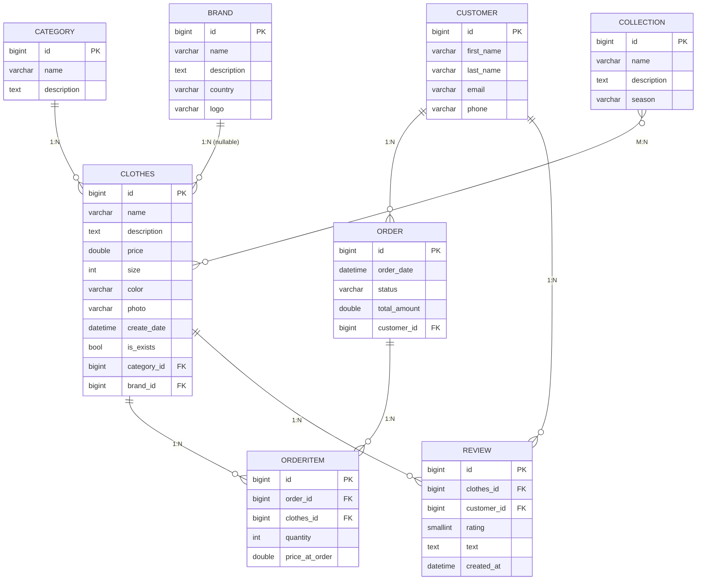

## Логическая схема БД (ER)

Сущности и связи предметной области «интернет-магазин одежды».

```mermaid
erDiagram
    CATEGORY ||--o{ CLOTHES : "1:N"
    BRAND ||--o{ CLOTHES : "1:N (nullable)"
    COLLECTION }o--o{ CLOTHES : "M:N"

    CUSTOMER ||--o{ ORDER : "1:N"
    ORDER ||--o{ ORDERITEM : "1:N"
    CLOTHES ||--o{ ORDERITEM : "1:N"

    CUSTOMER ||--o{ REVIEW : "1:N"
    CLOTHES ||--o{ REVIEW : "1:N"

    CATEGORY {
      bigint id PK
      varchar name
      text description
    }
    COLLECTION {
      bigint id PK
      varchar name
      text description
      varchar season
    }
    BRAND {
      bigint id PK
      varchar name
      text description
      varchar country
      varchar logo
    }
    CLOTHES {
      bigint id PK
      varchar name
      text description
      double price
      int size
      varchar color
      varchar photo
      datetime create_date
      bool is_exists
      bigint category_id FK
      bigint brand_id FK
    }
    CUSTOMER {
      bigint id PK
      varchar first_name
      varchar last_name
      varchar email
      varchar phone
    }
    ORDER {
      bigint id PK
      datetime order_date
      varchar status
      double total_amount
      bigint customer_id FK
    }
    ORDERITEM {
      bigint id PK
      bigint order_id FK
      bigint clothes_id FK
      int quantity
      double price_at_order
    }
    REVIEW {
      bigint id PK
      bigint clothes_id FK
      bigint customer_id FK
      smallint rating
      text text
      datetime created_at
    }
```

